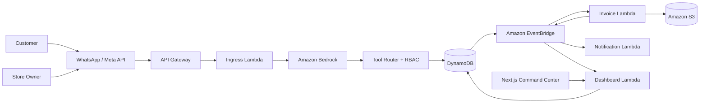

# WBOS (First Commit)

**WBOS turns WhatsApp from a messaging channel into a business operating system.**

## What is WBOS?
WBOS is an event-driven, multi-tenant AWS architecture that allows small business owners and their customers to interact with a centralized operational system purely through natural language on WhatsApp, powered by Amazon Bedrock.

> **Note:** This repository (WBOS v2 - First Commit) represents a fresh implementation and entirely new cloud-native architecture built specifically for the First Commit Hackathon. It is structurally distinct from the legacy v1 WBOS codebase.

## The Problem
Small businesses already communicate with customers through WhatsApp, but their orders, inventory, invoices, and operational intelligence are fragmented across notebooks, spreadsheets, or disjointed apps.

## The Solution
Instead of forcing the customer or the owner to download a new app, WBOS brings the system of record to WhatsApp.
* **Customers** can browse inventory, place orders, and check status using natural language.
* **Owners** can ask "How much did we sell today?" or "What's low on stock?" and get deterministic operational BI.
* **The Command Center** provides a traditional visual operational dashboard for the back office, synchronized in real-time with the same state.

## Key Features
* **Multi-Persona Conversational UI:** Separate agent behaviors for Customers vs. Owners.
* **Deterministic Tool Execution:** Bedrock drives the reasoning, but atomic DynamoDB transactions guarantee state consistency (no AI hallucinations can corrupt orders).
* **Idempotency:** Webhook deduplication prevents duplicate orders on network retries.
* **Event-Driven Automation:** Orders trigger asynchronous S3 PDF invoicing and notifications.
* **Tenant Isolation:** Multi-tenant architecture securely isolates data between stores.

## Architecture

**Bedrock interprets. Lambda authorizes and executes. DynamoDB stores. EventBridge coordinates.**



## AWS Services
* **API Gateway & Lambda**: HTTP ingress and transactional compute.
* **Amazon Bedrock**: LLM orchestration (`anthropic.claude-3-haiku-20240307-v1:0`).
* **Amazon DynamoDB**: Single-table design for atomic transactions and relational querying.
* **Amazon EventBridge**: Core event bus for asynchronous workflow choreography.
* **Amazon S3**: Immutable blob storage for generated PDF invoices.
* **AWS IAM**: Strict least-privilege policies (e.g., read-only dashboard policies).

## Security Model
The LLM does **not** control authorization. 
When Bedrock selects a tool to use (e.g., `get_daily_sales`), the request must pass through a deterministic RBAC guard before executing against DynamoDB. If a `CUSTOMER` is tricked into invoking an owner-only tool, the guard strictly rejects it with `403 AccessDenied`. Tenant boundaries are strongly enforced at the data access layer via Partition Keys (`TENANT#...`).

## Conversational BI
Owners can ask complex analytical questions directly in WhatsApp. Bedrock selects appropriate BI tools (like `get_sales_summary` or `get_low_stock_products`), and the system retrieves the live, tenant-scoped data from DynamoDB to construct the answer.

## Event-Driven Automation
When an order is placed, an `OrderCreated` event is emitted to EventBridge. This triggers the Invoice Lambda (to generate an S3 PDF) and Notification Lambda in parallel, removing synchronous blocking from the user's conversational flow.

## Command Center
A modern Next.js (App Router) + Tailwind CSS + shadcn/ui dashboard that provides owners with a visual operational layer. It consumes the exact same DynamoDB state and EventBridge feed as the WhatsApp bot.

## Demo
Please refer to the enclosed `demo-script.md` for a complete end-to-end walkthrough demonstrating Customer flows, Event Automation, Owner BI, and Security guardrails.

## Local Development
Requires Python 3.12+ and AWS SAM CLI.
```bash
sam build
sam local start-api
```
Run the command center:
```bash
cd dashboard
npm install
npm run dev
```

## AWS Deployment
Deploy the stack using AWS SAM:
```bash
sam build
sam deploy --guided
```

## Environment Variables
See `.env.example` for required deployment and local configuration values. Never commit actual secrets.

## Testing
Comprehensive testing requires `pytest` and `moto` for local AWS emulation:
```bash
pip install -r tests/requirements-dev.txt
python -m pytest
```

## Project Structure
```text
wbos-first-commit/
├── template.yaml            # AWS SAM IaC Definition
├── src/                     # Lambda application code
│   ├── handlers/            # Entrypoints (ingress, dashboard, invoice, notification)
│   ├── core/                # Auth, Database, Bedrock, Eventing
│   ├── services/            # Domain logic (orders, products, analytics)
│   └── security/            # Webhook HMAC verification
├── tests/                   # Pytest suite with Moto mocks
├── dashboard/               # Next.js Web Command Center
└── scripts/                 # Utility scripts (e.g. seed_demo_data.py)
```

## Hackathon Build Notes
Built exclusively for the **First Commit** Hackathon event. This repository was cleanly scaffolded during the hackathon window to validate a completely new cloud-native and event-driven architecture, moving beyond the legacy v1 prototype.

## Team
[Team/Contributor Names]

## License
MIT License
