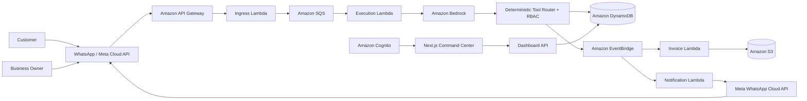
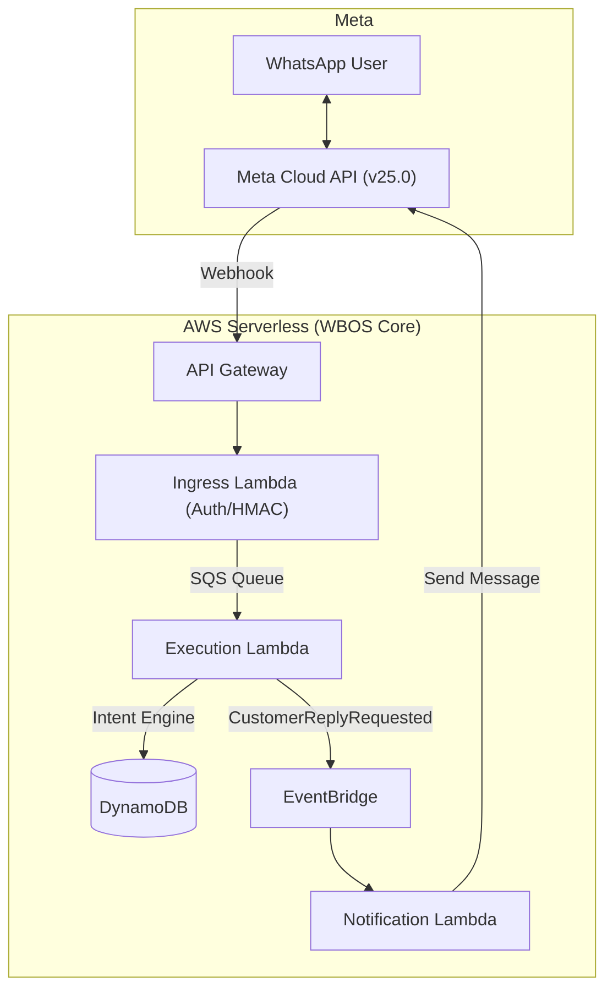

# WBOS — WhatsApp Business Operating System

> Turn WhatsApp into the operating system for a small business.

WBOS is a cloud-native, event-driven business operating system that lets
customers and business owners interact with business operations through
WhatsApp, while providing a web-based command center for operational
visibility.

The First Commit implementation is built around AWS serverless services,
Amazon Bedrock, deterministic tool execution, DynamoDB, EventBridge, SQS,
S3, Cognito, and the Meta WhatsApp Cloud API.

---

## Executive Summary

Small businesses often use WhatsApp as their primary customer communication
channel, while orders, inventory, customer records, invoices, and analytics
remain scattered across spreadsheets, notebooks, and disconnected systems.

WBOS brings these operations together.

A customer can communicate with the business through WhatsApp.
A business owner can use natural language to query operational data.
Behind the scenes, AWS services process the request, validate authorization,
execute deterministic business operations, persist state, and emit events.

### Core principle

**Bedrock interprets. Lambda validates and executes. DynamoDB stores.
EventBridge coordinates.**

The LLM does not directly modify business state.

---

## Hackathon Context

This repository is the First Commit implementation of WBOS for the
**Bharat Builds Tour — First Commit** hackathon.

The implementation is intentionally separated from the earlier WBOS
prototype.

The legacy WBOS application was used as a product and domain reference.
The implementation contained in this repository was rebuilt around a
new AWS-native architecture during the First Commit event window.

The repository history is preserved to provide an auditable development
timeline.

---

# The Problem

Small businesses frequently rely on WhatsApp for:

- Customer communication
- Order collection
- Product enquiries
- Order status updates
- Customer support

However, their actual operational state may live elsewhere:

- Spreadsheets
- Paper records
- Separate inventory applications
- Manual invoices
- Disconnected CRM systems
- Manual reporting

This creates operational fragmentation.

The business needs a system that can understand natural-language requests
without allowing an AI model to directly control business-critical state.

---

# The WBOS Approach

WBOS uses WhatsApp as the conversational interface while AWS provides the
operational backend.

### Customers

Customers can interact with the business through WhatsApp to:

- Browse products
- Place orders
- Check order status
- Ask product-related questions
- Receive order notifications

### Business Owners

Owners can use natural language for operational queries such as:

```text
How much did we sell today?

Which products are running low?

Show today's orders.

What is the status of order 1042?
```

The request is interpreted by Amazon Bedrock and converted into a structured
tool request.

The actual operation is then performed by deterministic application logic.

### Command Center

The web dashboard provides a visual operational layer for:

* Customers
* Orders
* Inventory
* Conversations
* Events
* Operational analytics
* System activity

The dashboard uses the same underlying business state as the WhatsApp
workflow.

---

# Architecture



---

# Request Execution Model

WBOS intentionally separates **AI interpretation** from **business
execution**.

```text
Incoming WhatsApp message
        │
        ▼
API Gateway
        │
        ▼
Ingress Lambda
        │
        ├── HMAC verification
        ├── webhook validation
        ├── idempotency
        └── enqueue request
                │
                ▼
             SQS
                │
                ▼
        Execution Lambda
                │
                ▼
         Amazon Bedrock
                │
                ▼
      Structured tool request
                │
                ▼
       Tool Router + RBAC
                │
        ┌───────┴────────┐
        ▼                ▼
   Authorization     Validation
        │                │
        └───────┬────────┘
                ▼
          Business Logic
                │
                ▼
            DynamoDB
                │
                ▼
          Domain Event
                │
                ▼
          EventBridge
          ┌─────┴─────┐
          ▼           ▼
       Invoice    Notification
        Lambda       Lambda
          │           │
          ▼           ▼
          S3      Meta WhatsApp
```

---

# Security Architecture

Security is enforced outside the LLM.

The system follows the principle:

> **The model can request an operation; the application decides whether
> that operation is allowed.**

The execution pipeline includes:

1. Webhook signature verification
2. Request validation
3. Webhook idempotency
4. Tenant resolution
5. Persona / role resolution
6. Tool validation
7. RBAC authorization
8. Business-rule validation
9. DynamoDB persistence
10. Event emission

The LLM is therefore not treated as a trusted authorization layer.

---

# Deterministic Tool Execution

Amazon Bedrock is responsible for interpreting natural-language requests.

For example:

```text
"How much did we sell today?"
```

may result in a structured tool request such as:

```text
get_sales_summary
```

The application then validates:

```text
User identity
      ↓
Tenant
      ↓
Role
      ↓
Requested tool
      ↓
Tool parameters
      ↓
Business rules
      ↓
DynamoDB operation
```

A customer cannot gain owner-level access simply by asking the model to
perform an owner-only operation.

---

# Multi-Tenancy

WBOS is designed around tenant isolation.

Business data is scoped to a tenant, with authorization enforced before
data access.

The architecture is designed so that:

```text
Tenant A
   ├── Customers
   ├── Orders
   ├── Inventory
   └── Events

Tenant B
   ├── Customers
   ├── Orders
   ├── Inventory
   └── Events
```

cannot be mixed through ordinary application operations.

---

# Idempotent Webhooks

WhatsApp and network infrastructure can retry webhook deliveries.

WBOS protects the execution pipeline against duplicate processing using
DynamoDB conditional writes.

A webhook event is recorded before it is accepted for processing.

Duplicate webhook deliveries are therefore detected without creating
duplicate business transactions.

---

# Event-Driven Architecture

WBOS uses Amazon EventBridge for domain-event choreography.

Example:

```text
OrderCreated
    │
    ├── Invoice generation
    │       └── PDF → S3
    │
    └── Customer notification
            └── Meta WhatsApp Cloud API
```

This separates the transactional order operation from downstream
processing.

The conversational request does not need to synchronously wait for every
secondary operation to complete.

---

# Reliability

The execution path uses Amazon SQS between webhook ingestion and business
execution.

SQS provides asynchronous buffering and retry behavior.

Failed messages can be retried and eventually routed to a Dead Letter Queue
after the configured retry threshold.

```text
API Gateway
     ↓
Ingress Lambda
     ↓
SQS
     ↓
Execution Lambda
     │
     ├── success → processing continues
     │
     └── failure → retry
                    │
                    └── DLQ
```

---

# WhatsApp Integration

WBOS integrates with the Meta WhatsApp Cloud API.

The webhook endpoint supports:

* WhatsApp webhook verification
* Incoming message processing
* HMAC SHA-256 signature verification
* Idempotent event handling
* Outbound customer notifications

Meta credentials are stored outside source control using AWS Secrets
Manager.

Secrets are never committed to the repository.

---

# Amazon Bedrock

Amazon Bedrock provides natural-language interpretation for WBOS.

The application architecture keeps the model integration behind the
execution layer so that model output is converted into structured,
validated operations before business state is changed.

## Current AWS Access Status

At the time of this README update, the AWS account's Amazon Bedrock
invocation authorization is **pending AWS Support resolution**.

The account currently returns:

```text
ValidationException: Operation not allowed
```

for Bedrock model invocation.

This is an AWS account-level authorization issue rather than an application
fallback mechanism.

### Important

WBOS does **not** use a fake LLM response or a production Demo Adapter to
hide this limitation.

There is no simulated execution path in the production implementation.

Once AWS authorizes Bedrock invocation, the same production execution
pipeline will be used for the live end-to-end transaction.

---

# No Demo Execution Path

The current implementation intentionally does not include:

* Demo execution mode
* Simulated Bedrock responses
* Browser webhook simulator
* Fake customer transactions
* Simulated WhatsApp notifications
* Hardcoded production authentication tokens

The goal is to demonstrate the actual architecture and actual AWS
execution path.

Where an external dependency is unavailable, that limitation is exposed
rather than replaced with fabricated production behavior.

---

# AWS Services

| Service                     | Responsibility                                     |
| --------------------------- | -------------------------------------------------- |
| **Amazon API Gateway**      | WhatsApp webhook ingress and dashboard API         |
| **AWS Lambda**              | Application execution and business logic           |
| **Amazon SQS**              | Asynchronous execution queue and retry boundary    |
| **Amazon DynamoDB**         | Business state, idempotency and tenant-scoped data |
| **Amazon EventBridge**      | Domain-event orchestration                         |
| **Amazon S3**               | Generated invoice/document storage                 |
| **Amazon Bedrock**          | Natural-language interpretation                    |
| **Amazon Cognito**          | Dashboard authentication                           |
| **AWS Secrets Manager**     | Meta API credential storage                        |
| **AWS IAM**                 | Least-privilege authorization                      |
| **Meta WhatsApp Cloud API** | Customer messaging channel                         |

Infrastructure is defined using **AWS SAM / CloudFormation**.

---

# Command Center

WBOS includes a Next.js-based web command center.

The dashboard provides an operational interface for the business owner,
including:

* Business overview
* Orders
* Customers
* Inventory
* Conversations
* Event stream
* System activity
* AI interaction visibility
* Operational analytics

Authentication is handled using Amazon Cognito.

The dashboard is deployed using AWS Amplify.

---

# Technology Stack

## Backend

* Python 3.12
* AWS Lambda
* AWS SAM
* Amazon API Gateway
* Amazon SQS
* Amazon DynamoDB
* Amazon EventBridge
* Amazon S3
* Amazon Bedrock
* Amazon Cognito
* AWS Secrets Manager
* AWS IAM

## Frontend

* Next.js
* React
* TypeScript
* Tailwind CSS
* shadcn/ui

## External Integration

* Meta WhatsApp Cloud API

## Testing

* pytest
* moto
* AWS SAM local tooling

---

# Project Structure

```text
wbos-first-commit/
│
├── template.yaml
│
├── src/
│   ├── handlers/
│   │   ├── ingress/
│   │   ├── execution/
│   │   ├── dashboard/
│   │   ├── invoice/
│   │   └── notification/
│   │
│   ├── core/
│   │   ├── auth/
│   │   ├── database/
│   │   ├── bedrock/
│   │   └── eventing/
│   │
│   ├── services/
│   │   ├── orders/
│   │   ├── products/
│   │   ├── customers/
│   │   └── analytics/
│   │
│   └── security/
│       └── webhook/
│
├── dashboard/
│   └── Next.js command center
│
├── tests/
│
├── scripts/
│
├── demo-script.md
│
└── README.md
```

---

# Local Development

Requirements:

* Python 3.12+
* AWS CLI
* AWS SAM CLI
* Node.js 20+

Build the backend:

```bash
sam build
```

Run the API locally:

```bash
sam local start-api
```

Run the dashboard:

```bash
cd dashboard
npm install
npm run dev
```

---

# Testing

Install development dependencies:

```bash
pip install -r tests/requirements-dev.txt
```

Run the test suite:

```bash
python -m pytest
```

The test suite covers application behavior using local mocks and AWS
service emulation where appropriate.

---

# AWS Deployment

Build:

```bash
sam build
```

Validate:

```bash
sam validate --lint
```

Deploy:

```bash
sam deploy --guided
```

Infrastructure configuration is maintained through
`template.yaml`.

---

# Environment Configuration

Environment-specific configuration is supplied through deployment
configuration and environment variables.

Examples include:

```text
AWS_REGION
META_GRAPH_API_VERSION
NEXT_PUBLIC_REGION
NEXT_PUBLIC_USER_POOL_ID
NEXT_PUBLIC_USER_POOL_CLIENT_ID
```

Actual credentials and secrets must never be committed to Git.

Meta credentials are stored in AWS Secrets Manager.

---

# Design Principles

### 1. AI interprets, applications execute

The LLM is not the database administrator.

### 2. Authorization is deterministic

RBAC is enforced by application code rather than by prompting the model.

### 3. Business state is authoritative

DynamoDB is the source of operational state.

### 4. Events decouple workflows

EventBridge coordinates downstream operations.

### 5. Webhooks are idempotent

Retries must not create duplicate business transactions.

### 6. Secrets stay outside source control

External credentials are stored using AWS Secrets Manager.

### 7. No fabricated production behavior

Unavailable infrastructure dependencies are reported rather than simulated
inside the production execution path.

---

# Current Implementation Status

| Component                                               | Status                            |
| ------------------------------------------------------- | --------------------------------- |
| AWS SAM infrastructure                                  | Implemented                       |
| API Gateway                                             | Implemented                       |
| Webhook verification                                    | Implemented                       |
| HMAC SHA-256 validation                                 | Implemented                       |
| Webhook idempotency                                     | Implemented                       |
| SQS execution queue                                     | Implemented                       |
| Lambda execution worker                                 | Implemented                       |
| DynamoDB persistence                                    | Implemented                       |
| Deterministic Tool Router                               | Implemented                       |
| RBAC enforcement                                        | Implemented                       |
| EventBridge domain events                               | Implemented                       |
| S3 invoice workflow                                     | Implemented                       |
| Meta WhatsApp integration                               | Implemented                       |
| Cognito dashboard authentication                        | Implemented                       |
| Next.js command center                                  | Implemented                       |
| Demo execution adapter                                  | Removed                           |
| Simulator API                                           | Removed                           |
| Bedrock account authorization                           | **Pending AWS Support**           |

## Architecture (Serverless Event-Driven)



### Components:
- **API Gateway**: Provides the public HTTP endpoint for Meta webhook.
- **Ingress Lambda**: Performs Meta HMAC validation, deduplication (Idempotency), and enqueues messages.
- **SQS Queue**: Buffers incoming messages to handle high concurrency.
- **Execution Lambda**: Extracts intent using a deterministic Regex Intent Engine and fetches data from DynamoDB domain services.
- **EventBridge**: Decoupled event bus handling domain events (`CustomerReplyRequested`, `OrderCreated`).
- **Notification Lambda**: Responsible for all outbound communication back to Meta's Graph API.

The final end-to-end production transaction depends on AWS Bedrock account
authorization and successful Meta WhatsApp configuration.

---

# First Commit Demonstration

The intended live transaction is:

```text
Customer sends WhatsApp message
        ↓
Meta WhatsApp Cloud API
        ↓
API Gateway
        ↓
Ingress Lambda
        ↓
SQS
        ↓
Execution Lambda
        ↓
Amazon Bedrock
        ↓
Tool Router + RBAC
        ↓
DynamoDB
        ↓
EventBridge
        ↓
Notification Lambda
        ↓
Meta WhatsApp Cloud API
        ↓
Customer receives response
```

The Command Center provides the corresponding operational visibility.

---

# Hackathon Build Notes

WBOS is being developed for the **First Commit** hackathon.

The repository history is intentionally preserved so that implementation
work can be inspected through the commit timeline.

The project focuses on demonstrating:

* AWS as the core application platform
* Serverless architecture
* Event-driven execution
* Secure AI tool execution
* WhatsApp business automation
* Deterministic authorization
* Multi-tenant business state
* Operational observability
* A deployable cloud architecture

---

# Team

**Rishvin Reddy**

B.Tech Computer Science & Engineering
Woxsen University

---

# License

MIT License
