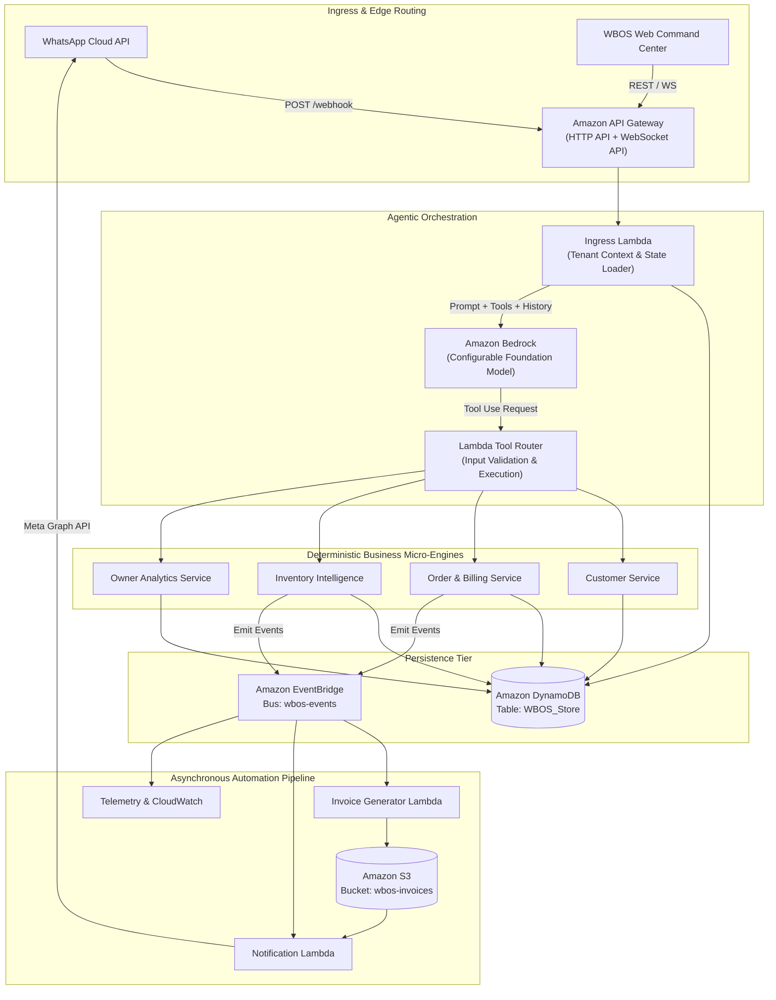

# WBOS v2 — Serverless Architecture & Execution Lifecycle

## 1. System Topology



---

## 2. Bedrock Foundation Model Agnostic Design

WBOS v2 interacts with Amazon Bedrock via the AWS SDK (`boto3`) Converse API or standard ConverseStream API. The Foundation Model is **not hard-coded** to an immutable model ID.

Instead, the model is configured via an environment variable:
```bash
BEDROCK_MODEL_ID="anthropic.claude-3-5-sonnet-20240620-v1:0" # or amazon.nova-pro-v1:0, mistral.large-2407-v1:0
BEDROCK_REGION="us-east-1"
```

The system sends tool definitions declared in `contracts/tools.json` to the selected Bedrock model. Bedrock returns structured JSON specifying tool names and validated parameters. If a model does not support native tool calling in a restricted sub-region, the system implements standard JSON function framing with zero application-code changes.

---

## 3. Request Execution Lifecycle

### 3.1 Inbound WhatsApp Webhook Flow
1. **Ingestion & Signature Check**: API Gateway receives Meta's webhook payload. Lambda Ingress verifies the `X-Hub-Signature-256` SHA256 HMAC header against Meta app secret.
2. **Tenant & Customer Resolution**:
   * Lambda parses sender phone number (e.g. `+919347761153`).
   * Queries DynamoDB GSI1 (`PHONE#+919347761153`) to retrieve customer record and active state.
3. **Takeover Check**:
   * If `customer.isTakeover == true`, AI invocation is skipped entirely. The incoming message is persisted in DynamoDB and pushed to the store manager dashboard via WebSocket.
4. **Bedrock Prompt Assembly**:
   * Constructs system prompt defining customer persona or store owner persona (based on registered role).
   * Passes conversational history + catalog context + available tool definitions.
5. **Tool Execution Loop**:
   * Bedrock analyzes message and emits tool request (e.g. `search_products(query="basmati rice")`).
   * Lambda Tool Router executes deterministic query against DynamoDB.
   * Returns tool result payload back to Bedrock.
   * Bedrock formats user-friendly conversational response.
6. **State Mutation & Event Emission**:
   * If an order is confirmed, Order Service executes DynamoDB `TransactWriteItems`.
   * Publishes `OrderCreated` or `OrderConfirmed` to Amazon EventBridge.
   * Dispatches WhatsApp response to customer.

---

## 4. Business Owner Intelligence Flow

When an authorized business owner texts the system from their registered phone number:
1. Lambda Ingress recognizes phone number belongs to tenant owner/manager role.
2. Bedrock is initialized with the **Store Operations & BI Persona**.
3. Owner asks: *"How much did we sell today and what's pending?"*
4. Bedrock emits dual tool invocations:
   * `get_daily_sales(date="2026-09-17")`
   * `get_pending_orders(status="PENDING")`
5. Lambda queries DynamoDB partition `TENANT#<t>#ANALYTICS` and GSI2 `STATUS#PENDING`.
6. Bedrock receives exact numbers and returns concise executive summary:
   > *"Today's total sales stand at **₹48,920** across 24 orders. You currently have **5 orders** awaiting store confirmation."*
