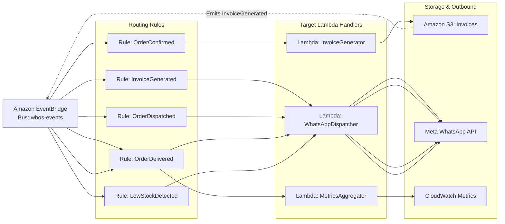

# WBOS v2 — EventBridge Event Architecture & Routing Rules

## 1. Event Bus Configuration

* **EventBus Name**: `wbos-events`
* **Delivery Guarantees**: At-least-once delivery with exponential backoff and SQS Dead-Letter Queue (DLQ).
* **Dead-Letter Queue**: `arn:aws:sqs:<region>:<account>:wbos-events-dlq`

---

## 2. EventBridge Rules & Target Topology



---

## 3. Rule Definitions & Event Matching Patterns

### Rule 1: Order Acceptance & Billing
* **Rule Name**: `wbos-order-confirmed-rule`
* **Event Pattern**:
  ```json
  {
    "source": ["wbos.orders"],
    "detail-type": ["OrderConfirmed"]
  }
  ```
* **Target**: `arn:aws:lambda:<region>:<account>:function:wbos-invoice-generator`
* **Action**: Fetches complete line items from DynamoDB, renders digital PDF Tax Invoice, uploads to S3 bucket `wbos-invoices`, and publishes `InvoiceGenerated` event.

### Rule 2: Outbound Invoice Dispatch
* **Rule Name**: `wbos-invoice-notify-rule`
* **Event Pattern**:
  ```json
  {
    "source": ["wbos.billing"],
    "detail-type": ["InvoiceGenerated"]
  }
  ```
* **Target**: `arn:aws:lambda:<region>:<account>:function:wbos-whatsapp-dispatcher`
* **Action**: Formats WhatsApp message containing line-item summary and pre-signed S3 PDF download link.

### Rule 3: Rider Dispatch Notification
* **Rule Name**: `wbos-dispatch-notify-rule`
* **Event Pattern**:
  ```json
  {
    "source": ["wbos.orders"],
    "detail-type": ["OrderDispatched"]
  }
  ```
* **Target**: `arn:aws:lambda:<region>:<account>:function:wbos-whatsapp-dispatcher`
* **Action**: Sends WhatsApp message with rider name, phone number, and live web tracking URL.

### Rule 4: Delivery Completion & Sales Aggregation
* **Rule Name**: `wbos-delivered-rule`
* **Event Pattern**:
  ```json
  {
    "source": ["wbos.orders"],
    "detail-type": ["OrderDelivered"]
  }
  ```
* **Targets**:
  1. `wbos-whatsapp-dispatcher`: Sends delivery completion & feedback thank-you message.
  2. `wbos-metrics-aggregator`: Atomically updates daily revenue counter in DynamoDB `TENANT#<t>#ANALYTICS`.

### Rule 5: Low Stock Procurement Alert
* **Rule Name**: `wbos-low-stock-alert-rule`
* **Event Pattern**:
  ```json
  {
    "source": ["wbos.inventory"],
    "detail-type": ["LowStockDetected"]
  }
  ```
* **Target**: `wbos-whatsapp-dispatcher`
* **Action**: Immediately alerts the registered business owner on WhatsApp with SKU details and recommended replenishment quantity.

---

## 4. Idempotency & Error Handling

1. **Idempotency Keys**: Every event includes an `idempotencyKey` formatted as `<tenantId>#<detailType>#<orderId>#<version>`.
2. **Lambda Deduplication**: Handlers maintain a 24-hour TTL check in DynamoDB to discard duplicate event deliveries.
3. **Retry Strategy**: EventBridge retries failed invocations 3 times with exponential jitter before pushing unhandled events to `wbos-events-dlq`.
