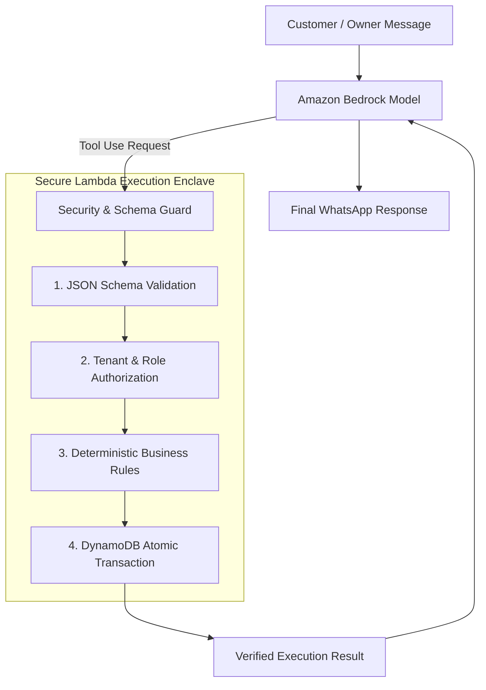

# WBOS v2 — Security & Compliance Architecture

## 1. Core Security Principles

Security in WBOS v2 is architectural, not an afterthought. The platform operates on four foundational security pillars:
1. **Zero-Trust LLM Boundary**: Foundation Models are untrusted interpretation engines. They never touch databases directly.
2. **Cryptographic Webhook Verification**: All incoming webhooks must prove Meta origin before execution.
3. **Strict Multi-Tenant Isolation**: Tenant partitions enforce logical boundaries at the persistence and compute layers.
4. **Least-Privilege IAM Roles**: Every Lambda function possesses fine-grained, minimal IAM permissions.

---

## 2. Zero-Trust LLM Boundary



### The 4-Layer Execution Guard
1. **JSON Schema Validation**: Inbound tool arguments are validated against `contracts/tools.json`. Extra or malformed properties cause an immediate rejection before domain execution.
2. **Tenant & Role Authorization**:
   * The tool caller cannot specify an arbitrary `tenantId`. The `tenantId` is injected strictly from the authenticated execution context.
   * Executive BI tools (`get_daily_sales`, `get_sales_summary`) require the caller's phone number to be an authorized manager in DynamoDB.
3. **Deterministic Business Rules**:
   * LLMs cannot override pricing, discount slabs, tax rates, or inventory levels.
   * State transitions are evaluated against deterministic finite-state transition tables (`can_transition`).
4. **Atomic Mutations**:
   * Mutations occur via DynamoDB condition expressions and transactions (`TransactWriteItems`), preventing race conditions and double-spending.

---

## 3. Webhook Ingress Verification

### Meta Signature Validation (POST)
Every incoming POST request from WhatsApp includes an `X-Hub-Signature-256` header.
```python
import hmac
import hashlib

def verify_meta_signature(raw_body: bytes, signature_header: str, app_secret: str) -> bool:
    if not signature_header or not signature_header.startswith("sha256="):
        return False
    expected_hash = signature_header[7:]
    generated_hash = hmac.new(
        key=app_secret.encode("utf-8"),
        msg=raw_body,
        digestmod=hashlib.sha256
    ).hexdigest()
    # Timing-attack safe comparison
    return hmac.compare_digest(generated_hash, expected_hash)
```
Any payload with an invalid or missing signature is rejected with HTTP 403 before parsing.

### Verification Token (GET)
Webhook challenge verification requires exact matching against the secret environment variable `WHATSAPP_VERIFY_TOKEN`.

---

## 4. Multi-Tenant Isolation

1. **Partition Namespace**: All DynamoDB partition keys are prefixed with `TENANT#<tenantId>`. No cross-tenant queries are structurally possible.
2. **Context Resolution**: The tenant ID is derived during ingress:
   * For WhatsApp messages: Derived from the recipient WhatsApp Business Account (WABA ID) or Store Phone ID.
   * For Command Center web sessions: Derived from AWS Cognito JWT claims (`custom:tenant_id`).

---

## 5. IAM Least Privilege Policies

| Lambda Function | Permitted IAM Actions | Target Resource Constraints |
| :--- | :--- | :--- |
| **Ingress Lambda** | `bedrock:InvokeModel`, `dynamodb:GetItem`, `dynamodb:Query` | Active Bedrock Model ARN, `WBOS_Store` Table ARN |
| **Order Service** | `dynamodb:TransactWriteItems`, `events:PutEvents` | `WBOS_Store` Table ARN, `wbos-events` Bus ARN |
| **Invoice Generator** | `s3:PutObject`, `dynamodb:GetItem`, `events:PutEvents` | `arn:aws:s3:::wbos-invoices/*`, `wbos-events` Bus ARN |
| **WhatsApp Dispatcher** | `kms:Decrypt`, `ssm:GetParameter` | WhatsApp Access Token Secret ARN |
| **Metrics Aggregator** | `dynamodb:UpdateItem`, `cloudwatch:PutMetricData` | `WBOS_Store` Table ARN |
